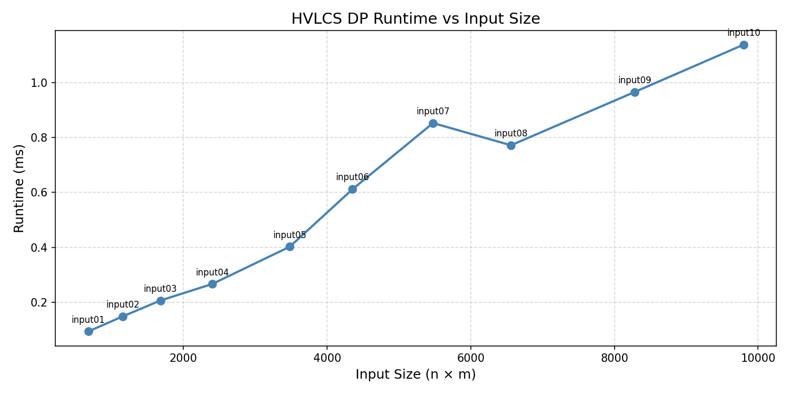

# Programming Assignment 3: HVLCS

Giuliano Di Lorenzo - UFID: 85720434

Jesse Bloom - UFID: 30570694

## How to Run

```
py src/Programming_assignment_3_algs.py < data/Input1.txt
```

## Repo Structure

- `src/` — main program
- `data/` — 10 test input files
- `generate_graph.py` — runs all inputs and saves runtime_graph.png
- `runtime_graph.png` — output graph

## Generating the Graph

```
py generate_graph.py
```

Requires matplotlib: `pip install matplotlib`

## Assumptions

- All character values are nonnegative integers.
- Input strings only contain characters defined in the alphabet.
- If multiple optimal subsequences exist, the program outputs any one of them.

## Question 1: Empirical Comparison



We ran the program on 10 input files with string lengths ranging from 25 to 100 characters. The x-axis is n x m (the DP table size) and the y-axis is runtime in milliseconds. The runtimes grow roughly linearly with nxm, consistent with the O(nm) complexity.

## Question 2: Recurrence Equation

Let dp[i][j] be the maximum value of a common subsequence of the first i characters of A and the first j characters of B.

Base cases:
- dp[i][0] = 0 for all i
- dp[0][j] = 0 for all j

If either string is empty, the only common subsequence is the empty one. Since all values are nonnegative, its value is 0.

Recurrence:

If A[i-1] == B[j-1]:
  dp[i][j] = max(dp[i-1][j-1] + value(A[i-1]), dp[i-1][j], dp[i][j-1])

If A[i-1] != B[j-1]:
  dp[i][j] = max(dp[i-1][j], dp[i][j-1])

This works because at every position (i, j), any optimal solution must come from one of these subproblems: skip from A, skip from B, or include the matching character. We take the best of all valid options, so we never miss a better solution. Since we fill the table from smaller prefixes to larger ones, all subproblems are solved before we need them.

## Question 3: Big-Oh

Pseudocode:

```
HVLCS-Value(A, B, values):
  n = length(A)
  m = length(B)
  create dp table of size (n+1) x (m+1), initialized to 0

  for i = 1 to n:
    for j = 1 to m:
      if A[i-1] == B[j-1]:
        match_value = dp[i-1][j-1] + values[A[i-1]]
        dp[i][j] = max(match_value, dp[i-1][j], dp[i][j-1])
      else:
        dp[i][j] = max(dp[i-1][j], dp[i][j-1])

  return dp[n][m]
```

Runtime: O(nm). The DP table has (n+1)(m+1) entries, each filled once with constant work.
